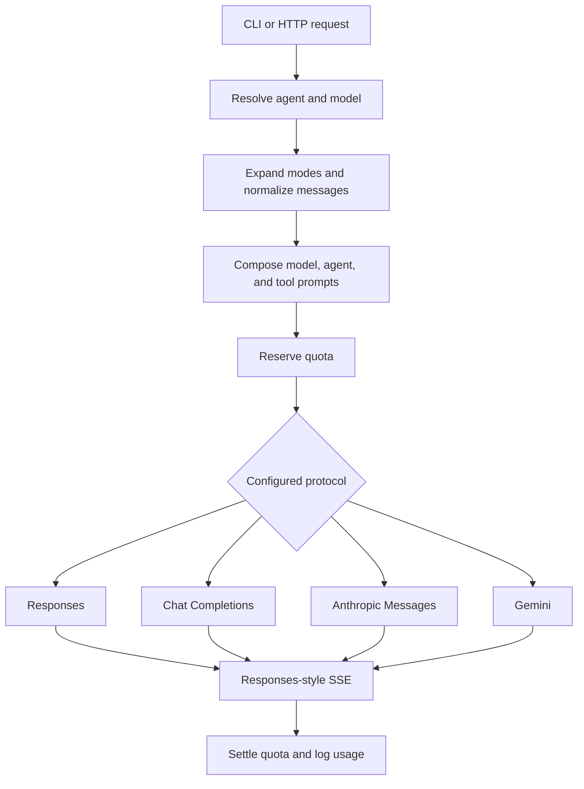

# Chancery

Chancery is a configuration-driven AI gateway written in Go. It turns Markdown files into addressable agents, composes their prompts with reusable modes and tool guidance, and exposes them through a single streaming HTTP API or a local CLI.

A canonical request pipeline sits in front of multiple upstream API shapes:

- OpenAI Responses-compatible APIs
- OpenAI Chat Completions-compatible APIs
- Anthropic Messages
- Google Gemini
- OpenAI-compatible embeddings

The gateway also provides optional JWT authentication and quota reservation/settlement, provider retry handling, explicit prompt caching, structured usage logs, and configuration validation.

## How it works



Agent behavior lives outside the binary in a configuration directory. `providers.yaml` defines providers and model aliases; Markdown files define prompts and URL paths. At request time Chancery:

1. resolves the requested agent and optional named model;
2. expands the final requested mode;
3. removes empty messages, reorders tool results, and extracts cache markers;
4. combines model-level, agent-level, and applicable tool prompts;
5. reserves quota when quota integration is enabled;
6. converts the canonical request to the selected provider protocol;
7. streams Responses-style server-sent events (SSE);
8. settles quota and emits normalized usage telemetry.

## Requirements

- Go `1.26.5`
- An external configuration directory
- An API key environment variable for every configured provider
- [`watchexec`](https://github.com/watchexec/watchexec) only when using `make dev`

`serve` additionally requires an agent whose route is exactly `embeddings`.

## Quick start

### 1. Create a configuration directory

The repository's `config/` directory is intentionally empty. A minimal configuration for the server looks like this:

```text
config/
├── providers.yaml
├── assistant.md
└── embeddings.md
```

`config/providers.yaml`:

```yaml
providers:
  primary:
    protocol: responses
    base_url: https://provider.example/v1
    api_key_env: PROVIDER_API_KEY
    models:
      chat:
        name: provider-chat-model
      embeddings:
        name: provider-embedding-model
        dimensions: 1536
```

`config/assistant.md`:

```markdown
---
description: General-purpose assistant
model: chat
---
You are a concise and helpful assistant.
```

`config/embeddings.md`:

```markdown
---
description: Embedding endpoint configuration
model: embeddings
---
```

Replace the example base URL and model names with values supported by your provider, then export the provider key:

```sh
export PROVIDER_API_KEY="..."
```

Provider keys are not required by `validate`, but `call` resolves the selected provider key and `serve` requires keys for every configured provider.

### 2. Validate and inspect the configuration

```sh
go run ./cmd/chancery --config ./config validate
go run ./cmd/chancery --config ./config list
go run ./cmd/chancery --config ./config list --json
```

### 3. Call an agent from the CLI

```sh
go run ./cmd/chancery --config ./config call assistant --input "Hello"
```

Input can also come from a file or stdin:

```sh
go run ./cmd/chancery --config ./config call assistant --input @prompt.txt
printf 'Hello' | go run ./cmd/chancery --config ./config call assistant
```

### 4. Start the server

```sh
go run ./cmd/chancery --config ./config serve
```

The default address is `:8081`.

```sh
curl --no-buffer http://localhost:8081/assistant \
  -H 'Content-Type: application/json' \
  -d '{"messages":[{"type":"message","role":"user","content":"Hello"}]}'
```

When JWT authentication is enabled, add `Authorization: Bearer <token>`.

## CLI

The global `--config PATH` flag is mandatory and must appear before the command.

```text
chancery --config PATH <serve|validate|list|call>
```

| Command | Purpose |
|---|---|
| `validate` | Load all configuration, print sorted errors and warnings, and return a non-zero status for errors. |
| `list [--json]` | List agent routes, models, reasoning settings, defaults, and registry totals. |
| `call <agent-path> [--input TEXT\|@FILE]` | Invoke one chat agent or the special `embeddings` agent. Reads stdin when `--input` is omitted. |
| `serve` | Start the HTTP gateway. |

Agent references use either the route itself or `route.named-model` for an agent with named alternatives.

## HTTP API

CORS preflight requests are handled globally. The health endpoint is public; application routes use the configured JWT middleware.

| Route | Request | Response |
|---|---|---|
| `GET /health` | None | `200 OK` with plain-text body `ok`. |
| `POST /embeddings` | `{"input":["text", "..."]}` | Upstream OpenAI-compatible embeddings JSON. |
| `POST /<agent-path>` | Canonical chat request | Responses-style SSE stream. |
| `POST /<agent-path>.<model-name>` | Canonical chat request using a named model | Responses-style SSE stream. |

The health endpoint reports only that the binary is accepting HTTP connections. It does not check provider connectivity, configuration dependencies, or external services.

### Chat requests

```json
{
  "messages": [
    {
      "type": "message",
      "role": "user",
      "content": "Explain structural sharing"
    }
  ],
  "tools": [],
  "response_format": {}
}
```

`messages` must contain at least one item. Message, tool, and response-format objects otherwise remain raw JSON until the selected protocol adapter converts them.

Optional query-string overrides:

| Parameter | Effect |
|---|---|
| `tool_choice` | Overrides the tool-choice strategy. |
| `temperature` | Overrides the configured temperature when it parses as a number. |
| `reasoning_summary` | Overrides the configured reasoning-summary setting. |

Successful translated streams use events such as:

- `response.output_text.delta`
- `response.reasoning_summary_text.delta`
- `response.output_item.added`
- `response.function_call_arguments.delta`
- `response.output_item.done`
- `response.failed`
- `response.completed`

Responses-compatible upstream SSE is relayed directly. The Completions, Anthropic, and Gemini adapters translate their streams into this event model.

### Embeddings

The embeddings route:

- accepts between 1 and 512 strings;
- rejects batches estimated above 200,000 tokens;
- estimates tokens as total input bytes divided by four;
- takes its model and optional dimensions from the `embeddings` agent;
- always calls the configured provider's OpenAI-compatible `/embeddings` endpoint;
- returns the successful upstream JSON body unchanged.

## Configuration directory

A full configuration may use this layout:

```text
config/
├── providers.yaml
├── assistant.md
├── review/
│   └── index.md
├── shared/
│   ├── policy.md
│   └── fragment.md
├── modes/
│   ├── planning.md
│   └── planning/
│       └── checklist.md
└── tools/
    ├── general.md
    └── guidance.search.md
```

Reserved directories:

| Directory | Purpose |
|---|---|
| `shared/` | Reusable Markdown fragments and model-level prompts. |
| `modes/` | Named prompt modes selected from request messages. |
| `tools/` | General and tool-specific guidance appended at request time. |

Hidden directories and Markdown filenames containing `.temp` are ignored.

### Agent routes

Markdown paths become HTTP/registry paths:

| File | Agent route |
|---|---|
| `assistant.md` | `assistant` |
| `review/index.md` | `review` |
| `review/security.md` | `review/security` |

A top-level `index.md` is invalid because it has no route. Markdown outside reserved directories must either contain agent frontmatter or be included by an agent; unused fragments are reported as orphans.

### Providers and models

`providers.yaml` has this shape:

```yaml
providers:
  provider-key:
    protocol: responses
    base_url: https://provider.example/v1
    api_key_env: PROVIDER_API_KEY
    strict: false
    models:
      base-model:
        name: provider-model-id
        reasoning_effort: low
      deep-model:
        extends: base-model
        name: provider-deep-model-id
        reasoning_effort: high
        service_tier: priority
```

Provider fields:

| Field | Required | Meaning |
|---|---:|---|
| `protocol` | Yes | `responses`, `completions`, `anthropic`, or `gemini`. |
| `base_url` | Yes | Upstream API base URL. The Gemini SDK does not use it, but validation still requires it. |
| `api_key_env` | Yes | Name of the environment variable containing the API key. |
| `strict` | No | Adds strict function schemas in the Chat Completions adapter. |
| `models` | Yes | One or more globally unique model aliases. |

Model fields:

| Field | Meaning |
|---|---|
| `extends` | Parent model alias. Inheritance supports at most five extension steps. |
| `provider` | Provider override; defaults to the containing provider. |
| `name` | Upstream model name; defaults to the model alias. |
| `prompt` | Markdown file loaded from `shared/` and prepended to agent prompts. |
| `dimensions` | Embedding dimensions. |
| `max_tokens` | Provider output-token limit. |
| `reasoning_effort` | Provider-specific reasoning level. |
| `reasoning_summary` | Reasoning-summary behavior. |
| `verbosity` | Response verbosity when supported. |
| `service_tier` | Provider service tier. |
| `legacy_thinking` | Use Gemini token-budget thinking rather than thinking levels. |
| `cache_ttl` | Gemini explicit-cache TTL in seconds. |
| `seed` | Agent-only Gemini switch that enables the gateway's fixed deterministic seed. |
| `temperature` | Agent-only sampling-temperature override. |

The schema also accepts `type` and `auto_cache`. They are compatibility/reserved fields in the current request path: `type` does not alter dispatch, and provider caching is driven by explicit cache markers rather than `auto_cache`.

Unknown YAML fields are rejected.

### Agent frontmatter

A basic agent selects one model:

```markdown
---
description: Reviews code for correctness
model: deep-model
reasoning_summary: auto
temperature: 0.2
---
Review the supplied code. Prioritize correctness and actionable findings.
```

An agent may instead expose named alternatives:

```markdown
---
description: Assistant with fast and deep variants
models:
  fast:
    model: base-model
  deep:
    model: deep-model
    reasoning_effort: high
default: fast
---
Answer the user clearly.
```

This creates `assistant.fast` and `assistant.deep` references in addition to the default `assistant` route. With multiple named entries, `default` is required. A single named entry becomes the default automatically.

Agent settings override model settings. Named-model settings override the shared agent settings.

Supported agent settings are:

- `description`
- `model`, or `models` plus `default`
- `reasoning_effort`
- `reasoning_summary`
- `verbosity`
- `service_tier`
- `legacy_thinking`
- `temperature`
- `seed`
- `cache_ttl`
- `dimensions`
- `max_tokens`
- the currently reserved `auto_cache`

The prompt belongs in the Markdown body, not in a frontmatter `prompt` field.

### Reusable fragments

An include is a complete trimmed line containing a Markdown filename in brackets:

```markdown
---
model: base-model
---
[fragment.md]

Answer clearly.
```

Includes resolve relative to the agent first, then from `shared/`. Included files are inserted directly; includes inside an included fragment are not recursively expanded.

### Modes

Direct Markdown files under `modes/` define named modes. A request selects a mode with a system message whose content is exactly:

```markdown
<!-- prompt: planning -->
```

When multiple mode markers appear, only the last one is expanded and earlier markers are removed. A mode file can include local or shared fragments.

### Tool guidance

Markdown under `tools/` is appended to the system prompt:

- `tools/general.md` always applies;
- `tools/guidance.search.md` applies only when the request exposes a top-level tool named `search`.

Tool files are loaded recursively and joined in sorted order. Final system-prompt order is:

1. model prompt from `shared/`;
2. agent Markdown body;
3. applicable tool guidance.

### Explicit cache markers

A system message containing:

```markdown
<!-- cache -->
```

marks the preceding retained message as a provider cache breakpoint and is removed before dispatch.

- Anthropic applies ephemeral cache control to selected content.
- Gemini uses explicit caching only when at least one breakpoint exists and `cache_ttl` is positive.
- Gemini cache entries are process-local; cache creation failures fall back to uncached generation.

## Provider behavior

| Protocol | Upstream endpoint/client | Gateway behavior |
|---|---|---|
| `responses` | `<base_url>/responses` | Builds a streaming Responses request and relays upstream SSE. |
| `completions` | `<base_url>/chat/completions` | Converts messages, tools, reasoning, and usage to/from Chat Completions. |
| `anthropic` | `<base_url>/v1/messages` | Converts Messages content, tool calls/results, thinking, cache controls, and usage. |
| `gemini` | Google GenAI SDK | Converts content, tools, thought signatures, JSON output, caching, and usage. |

Provider-specific constraints still apply. For example, supported reasoning values and JSON-schema handling differ by adapter. Run `validate` to catch manifest errors; some upstream-specific constraints can only be checked while constructing or sending a request.

## Runtime environment

| Variable | Default | Behavior |
|---|---|---|
| `PORT` | `8081` | HTTP listen port. |
| `CORS_ORIGINS` | empty | Comma-separated allowed origins. Empty denies all cross-origin requests; set `*` to allow any origin. |
| `SHUTDOWN_TIMEOUT` | `60s` | Positive Go duration to drain in-flight requests on shutdown before exiting. |
| `LOG_LEVEL` | `info` | One of `debug`, `info`, `warn`, or `error`. |
| `ENV` | `development` | Added to every structured log record. |
| `LOG_REQUEST_HEADERS` | `X-Session-ID,X-Project-ID` | Comma-separated `X-*` headers copied into request logs. Set to an explicit empty value to disable. |
| `AUTH_JWT_JWKS_URL` | empty | HTTPS JWKS URL; enables JWT auth. |
| `AUTH_JWT_PUBLIC_KEY_FILE` | empty | Local PEM public key; enables JWT auth. |
| `AUTH_JWT_ISSUER` | empty | Required when JWT auth is enabled. |
| `AUTH_JWT_AUDIENCE` | empty | Required when JWT auth is enabled. |
| `AUTH_JWT_ALGORITHMS` | empty | Required comma-separated asymmetric algorithms when auth is enabled. |
| `QUOTA_RESERVE_URL` | empty | Quota reservation endpoint. |
| `QUOTA_SETTLE_URL` | empty | Quota settlement endpoint. |
| `QUOTA_AUTH_TOKEN` | empty | Optional bearer token for quota requests. |
| `QUOTA_TIMEOUT` | `2s` | Positive Go duration for quota calls. |
| Provider `api_key_env` variables | none | API keys named dynamically by `providers.yaml`. |

`LOG_REQUEST_HEADERS` accepts at most 16 header names. Each must canonicalize to an `X-*` header and cannot contain credential-like terms such as `auth`, `api-key`, `secret`, or `password`.

Standard Go HTTP proxy environment variables are honored for outbound provider traffic.

## Authentication

JWT authentication is disabled when both key-source variables are empty. When enabled:

- configure exactly one of `AUTH_JWT_JWKS_URL` or `AUTH_JWT_PUBLIC_KEY_FILE`;
- configure issuer, audience, and at least one accepted algorithm;
- send exactly one `Authorization: Bearer <token>` header;
- tokens must contain a valid, non-empty `sub` claim;
- issuer, audience, expiration, issued-at, signature, and algorithm are validated with 30 seconds of leeway.

Accepted algorithms are `RS256`, `RS384`, `RS512`, `PS256`, `PS384`, `PS512`, `ES256`, `ES384`, `ES512`, and `EdDSA`. Symmetric JWT algorithms are not accepted.

## Quotas, retries, and usage

Quota integration is disabled when both quota URLs are empty. Enabling either URL requires both.

For each request Chancery can:

1. reserve quota with request identity, user, endpoint, provider/model settings, estimated input, and maximum output;
2. reject denied reservations with `429` and an optional `Retry-After` header;
3. fail closed with `503` when reservation is unavailable;
4. settle completed, failed, or cancelled requests with normalized token usage.

Settlement failures are logged and do not change the client response.

Upstream chat and embedding calls use up to three attempts for provider-marked retryable failures such as connection timeouts and HTTP `429`. Cooldowns are held in memory per model, use jittered exponential backoff, and are local to one process; this is not an inbound per-user request-rate limiter.

## Logging and telemetry

Logs are JSON on stdout and include the configured environment. Request middleware adds:

- a random request ID;
- configured request-header values, truncated to 512 bytes;
- the authenticated JWT subject when available.

Completed calls emit structured usage records with endpoint, model, reasoning/service-tier settings, duration, token categories, and embedding input counts. Telemetry is log-based; the service does not initialize a metrics or tracing exporter.

## Development

```sh
# Run all tests
go test ./...

# Build ./bin/chancery
go build -o bin/chancery ./cmd/chancery
# or
make build

# Run through Make; CONFIG is required
make validate CONFIG=./config
make list CONFIG=./config
make start CONFIG=./config

# Restart on Go, Markdown, or YAML changes
make dev CONFIG=./config
```

The Makefile loads `.env.local` when present. `make start-prod` additionally sources `.prod.env.local`.

`make start`, `make start-prod`, and `make dev` first kill any process listening on port `8081`, even when a different `PORT` is configured.

## Repository layout

```text
cmd/chancery/           CLI entry point
internal/auth/               JWT configuration and validation
internal/bootstrap/          Runtime logger setup
internal/cli/                Cobra commands and terminal rendering
internal/config/             Environment configuration
internal/handlers/http/      Routes, middleware, chat, embeddings, and quota flow
internal/invoke/             Adapter-neutral agent invocation
internal/messages/           Pure message transforms
internal/pipeline/           Agent resolution and request assembly
internal/prompts/            Manifest loading, validation, fragments, modes, and tools
internal/protocol/           Canonical request, tool, and usage types
internal/providers/          Protocol dispatch and provider adapters
internal/quota/              External reserve/settle client
internal/ratelimit/          Retry and per-model cooldown coordination
internal/server/             HTTP server composition and startup
internal/telemetry/          Structured call records
internal/tokens/             Lightweight token estimation
config/                      Optional local external-config location
```

## Operational notes

- The server binds plain HTTP on all interfaces; terminate TLS at a reverse proxy or load balancer.
- JWT authentication and quota enforcement are both disabled by default.
- CORS denies cross-origin requests by default and never sends `Access-Control-Allow-Credentials`; set `CORS_ORIGINS` to allow specific origins (or `*`) for browser clients.
- The server applies `ReadHeaderTimeout`, `ReadTimeout`, and `IdleTimeout`, and drains in-flight requests on `SIGINT`/`SIGTERM` within `SHUTDOWN_TIMEOUT`. `WriteTimeout` is intentionally unset so long-lived SSE streams are not truncated.
- Request bodies are capped at 10 MiB; larger bodies are rejected before decoding.
- `/health` is a process-level check only; there are no dependency-aware readiness, liveness, metrics, or debug endpoints.
- Provider cooldowns and Gemini cache entries are process-local and are not shared between replicas.
